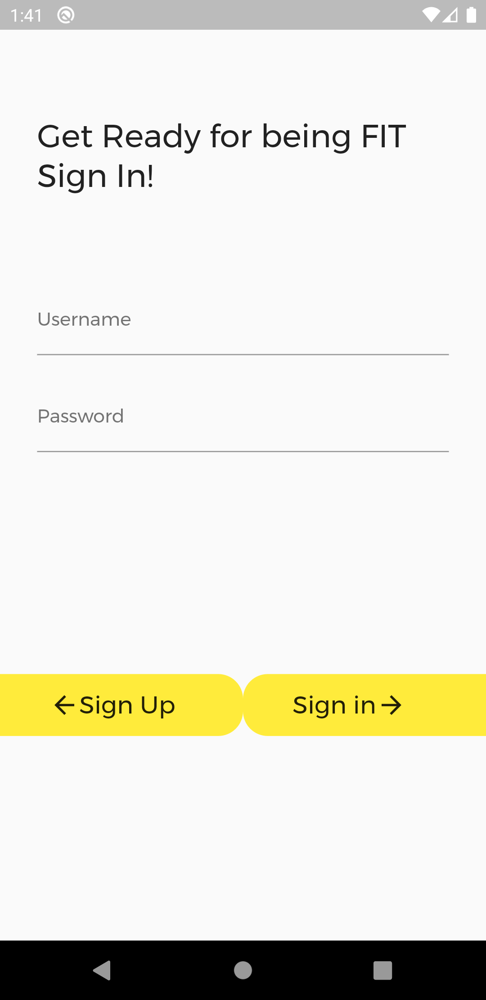
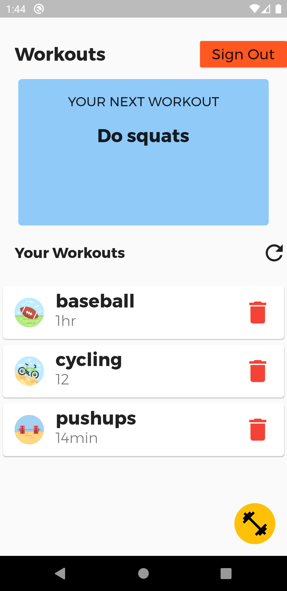
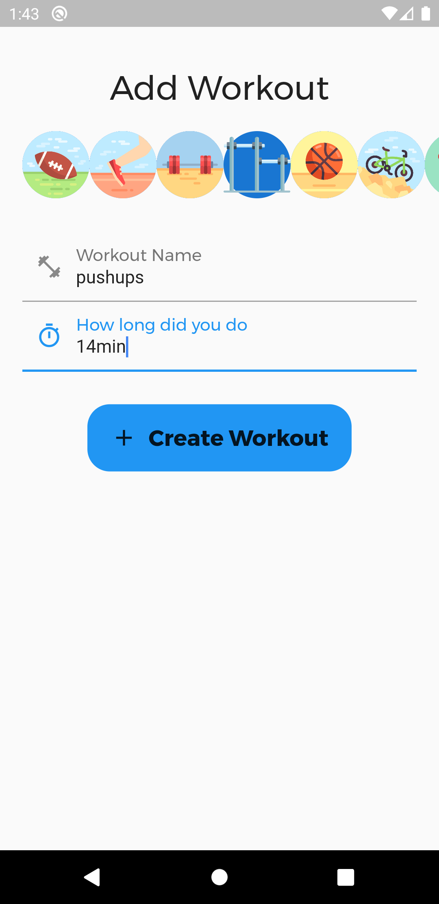

# easy_fitness

Flutter fitness tracker app made with flutter and cloud firestore

## All features

* Authentication system with cloud firestore
* Users can add workouts with title and time
* Users will be displayed everytime with a random workout as a suggestion
* Datbase used was cloud firestore

## Screenshots
  
 
